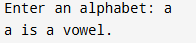
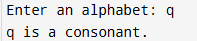
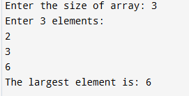
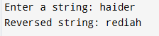
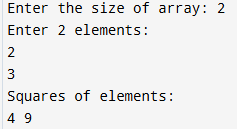
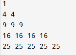

# C language Exam

This repository contains 5 beginner-friendly C programs covering basic logic, array manipulation, pointers, and pattern printing.

---

## ✅ 1. Vowel or Consonant Checker

This program checks whether a character entered by the user is a vowel or consonant using a `switch` statement.

## 📸 Sample Outputs





## ✅ 2. Find Largest Element in a 1D Array

Takes input for an array of integers and finds the largest element.

## 📸 Sample Outputs



## ✅ 3. Reverse a String Without Library Functions

This program defines a custom function to reverse a string, avoiding all built-in string functions.

## 📸 Sample Outputs



## ✅ 4. Square of Array Elements Using Pointers

Uses pointers to access elements of a 1D array and print the square of each element.

## 📸 Sample Outputs



## ✅ 5. Pattern Printing Using Nested Loops

Prints the following pattern using nested `for` loops:

```
1
4 4
9 9 9
16 16 16 16
25 25 25 25 25
```

## 📸 Sample Outputs



